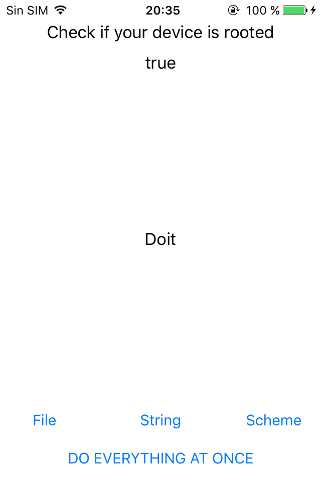

# RootCheck app iOS

This is an app that performs several checks to know if the device is jailbroken or not. The final result is something like this:

I know that it's not stilish but it does the job.

## Ways to check for jailbreak:

### Check for common files:

```swift
static func file_jailbreak() -> Bool{
    #if arch(i386) || arch(x86_64)
        println("Simulator")
        return false
    #else
        let fileManager = FileManager()
        let paths = [
        "/private/var/stash",
        "/private/var/lib/apt",
        "/private/var/tmp/cydia.log",
        "/private/var/lib/cydia",
        "/private/var/mobile/Library/SBSettings/Themes",
        "/Library/MobileSubstrate/MobileSubstrate.dylib",
        "/Library/MobileSubstrate/DynamicLibraries/Veency.plist",
        "/Library/MobileSubstrate/DynamicLibraries/LiveClock.plist",
        "/System/Library/LaunchDaemons/com.ikey.bbot.plist",
        "/System/Library/LaunchDaemons/com.saurik.Cydia.Startup.plist",
        "/var/cache/apt",
        "/var/lib/apt",
        "/var/lib/cydia",
        "/var/log/syslog",
        "/var/tmp/cydia.log",
        "/bin/bash",
        "/bin/sh",
        "/usr/sbin/sshd",
        "/usr/libexec/ssh-keysign",
        "/usr/sbin/sshd",
        "/usr/bin/sshd",
        "/usr/libexec/sftp-server",
        "/etc/ssh/sshd_config",
        "/etc/apt",
        "/Applications/Cydia.app",
        "/Applications/RockApp.app",
        "/Applications/Icy.app",
        "/Applications/WinterBoard.app",
        "/Applications/SBSettings.app",
        "/Applications/MxTube.app",
        "/Applications/IntelliScreen.app",
        "/Applications/FakeCarrier.app",
        "/Applications/blackra1n.app",
        ]
        for path in paths{
            if(fileManager.fileExists(atPath: path)) {
                return true
            }
        }
        return false
    #endif
}
```

### Check if the app can write outside of it's sandbox

```swift
static func string_jailbreak() -> Bool{
    do {
        try "jailbroken".write(toFile: "/var/root/jailbreak.txt", atomically: true, encoding: String.Encoding.utf8)
        try FileManager().removeItem(atPath: "/private/jailbreak.txts")
        return true
    } catch {
        return false
    }
}
```

### Check if it recognized cydia:// url scheme

```swift
static func scheme_jailbreak() -> Bool{
    return UIApplication.shared.canOpenURL(URL(string: "cydia://package/com.example.package")!)
}
```
